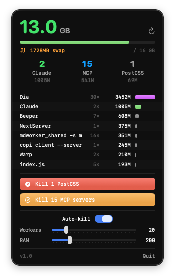

# Claude Monitor

<p align="center">
  
</p>

A lightweight macOS menu bar app that monitors Claude Code instances, MCP servers, and your per-user process count in real time — and auto-kills runaway processes before they crash your Mac.

> 📖 **Read the full story**: [How I tracked down a memory leak that crashed my Mac 5 times in 2 hours](https://blog.my-monkey.fr/posts/mcp-servers-crash-mac/) — the `@tailwindcss/postcss` bug that spawned 2261 workers in 50 seconds and pinned the per-user process limit.

## Features

- 🤖 Real-time count of Claude Code instances and MCP servers in the menu bar
- 🔢 Process count vs the per-user limit (`kern.maxprocperuid`) — the ceiling a worker swarm hits before the Mac can no longer fork
- ⚠️ Visual warning when the process count nears that limit
- 📊 RAM usage with color-coded progress bar (green/orange/red)
- 💽 Available disk space with a used/total bar (Finder-accurate, purgeable-aware)
- 📋 Top apps by memory consumption with mini bars
- 🔪 One-click kill for all MCP servers
- ⚙️ Auto-kill with configurable thresholds (process count % + RAM)
- 🔄 Refreshes every 5 seconds
- 💾 Minimal footprint (~10 MB RSS, native Swift)

## Install

```bash
git clone https://github.com/my-monkeys/claude-monitor
cd claude-monitor
bash install.sh
open /Applications/ClaudeMonitor.app
```

Requires macOS 14+ and Swift 5.9+.

## Build from source

```bash
swift build -c release
```

The executable lives in `.build/release/ClaudeMonitor`. To package it as a proper `.app` bundle (so it persists in the menu bar), run `bash install.sh`.

## Add to login items

System Settings → General → Login Items → add `/Applications/ClaudeMonitor.app`.

## How it works

The app runs `ps aux` every 5 seconds, classifies processes by name, counts the processes owned by your user, and reads free disk space natively. When RAM exceeds the auto-kill threshold or your process count crosses the configured fraction of `kern.maxprocperuid`, it sends `SIGKILL` to the MCP worker swarm.

No telemetry, no network, no dependencies beyond Apple's SwiftUI/AppKit.

## License

MIT — do whatever.
